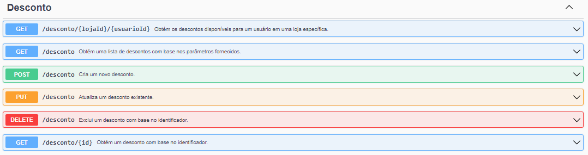
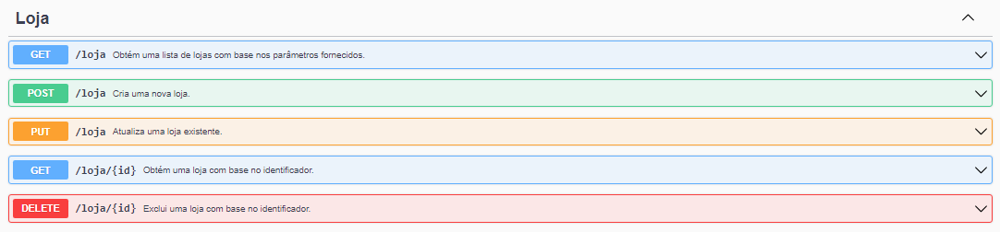
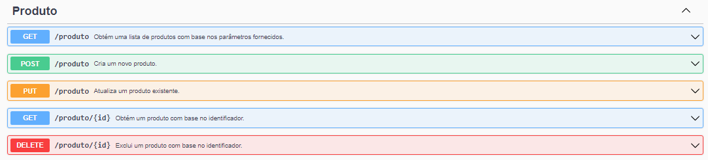
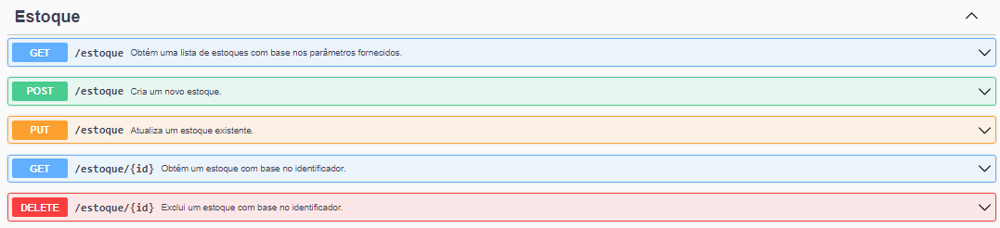
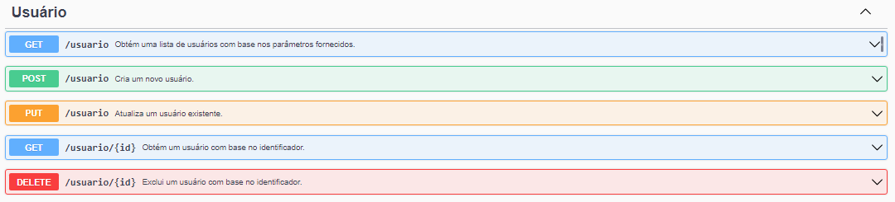

# Loja

### Swagger

Clique aqui para abrir as imagens do Swagger para facilitar a visualização das rotas atuais.

### Sql Server

O banco de dados adotado neste projeto foi o Sql Server. Para gerenciar o banco foi utilizado o SQL Server Management
Studio (SSMS).

| Nome                                |                                                    Doc                                                     |                                                      Download                                                       |
|:------------------------------------|:----------------------------------------------------------------------------------------------------------:|:-------------------------------------------------------------------------------------------------------------------:|
| Sql Server                          |              [Link](https://learn.microsoft.com/en-us/sql/sql-server/?view=sql-server-ver16)               |                       [Link](https://www.microsoft.com/pt-br/sql-server/sql-server-downloads)                       |
| SQL Server Management Studio (SSMS) | [Link](https://learn.microsoft.com/en-us/sql/ssms/sql-server-management-studio-ssms?view=sql-server-ver16) | [Link](https://learn.microsoft.com/pt-br/sql/ssms/download-sql-server-management-studio-ssms?view=sql-server-ver16) |

### Como configurar AppSettings

Copie o arquivo [appsettings.Exemple.json](Loja.API/appsettings.Exemple.json) e edite para configurar sua ``connection
string`` e outras configurações de ambiente.
Lembre-se de modificar a extenção "Exemple" para o nome do ambiente.

### Como rodar o projeto

* Certifique de ter configurado o Ambiente no ``appsettings`` corretamente com sua ``connection string``
* Certifique que o EntityFramework esteja instalado. Se não estiver pode ser feito com o
  comando: ``dotnet tool install --global dotnet-ef``
* Faça o ``restore`` dos pacotes NuGet. Pode ser feito por linha de comando com o comando: ``dotnet restore``
* Atualize os dados do banco de dados com o EntityFramework utilizando o comando: ``dotnet ef database update``. Isso
  irá subir todas as ``migrations`` para o banco de dados.
* Para rodar efetivamente o projeto basta usar o comando ``dotnet run``. Certifique que esteja configurado para rodar
  ambiente correto.

### Tecnologias usadas

| Nome                                    |                                                    Doc                                                    |                            Download                            |
|:----------------------------------------|:---------------------------------------------------------------------------------------------------------:|:--------------------------------------------------------------:|
| .NET 6                                  |                 [Link](https://docs.microsoft.com/en-us/aspnet/core/?view=aspnetcore-6.0)                 | [Link](https://dotnet.microsoft.com/en-us/download/dotnet/6.0) |
| Newtonsoft.Json                         |                    [Link](https://www.newtonsoft.com/json/help/html/Introduction.htm)                     |                                                                |
| Entity Framework Core 6                 |                             [Link](https://docs.microsoft.com/pt-br/ef/core/)                             |                                                                |
| Microsoft.EntityFrameworkCore.Design    | [Link](https://learn.microsoft.com/en-us/dotnet/api/microsoft.entityframeworkcore.design?view=efcore-8.0) |                                                                |
| Microsoft.EntityFrameworkCore.SqlServer |       [Link](https://learn.microsoft.com/pt-br/ef/core/providers/sql-server/?tabs=dotnet-core-cli)        |                                                                |
| Swashbuckle.AspNetCore                  |                     [Link](https://github.com/domaindrivendev/Swashbuckle.AspNetCore)                     |                                                                |
| Swashbuckle.AspNetCore.Annotations      |                     [Link](https://github.com/domaindrivendev/Swashbuckle.AspNetCore)                     |                                                                |
| System.Linq.Dynamic.Core                |                      [Link](https://github.com/zzzprojects/System.Linq.Dynamic.Core)                      |                                                                |

### Opções de IDE/Editores

| Nome                    |                            Download                            |  Tipo  |
|-------------------------|:--------------------------------------------------------------:|:------:|
| Visual Studio Code      |         [Link](https://code.visualstudio.com/download)         | Editor |
| Visual Studio Community | [Link](https://visualstudio.microsoft.com/pt-br/vs/community/) |  IDE   |
| JetBrains Rider         |    [Link](https://www.jetbrains.com/pt-br/rider/download/)     |  IDE   |

### Extensões para auxilio no desenvolvimento

| Nome          |                  Descrição                   |                   Link                   |
|:--------------|:--------------------------------------------:|:----------------------------------------:|
| **SonarLint** | Marca possíveis bug e code smells no código. | [Link](https://www.sonarlint.org/vscode) | 

